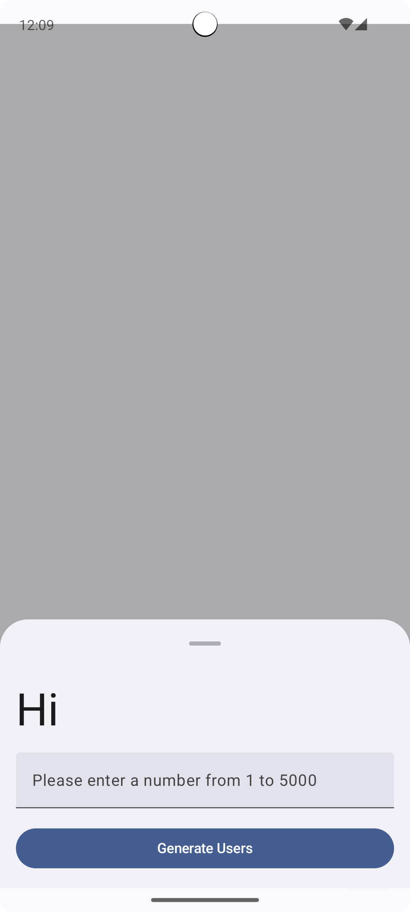
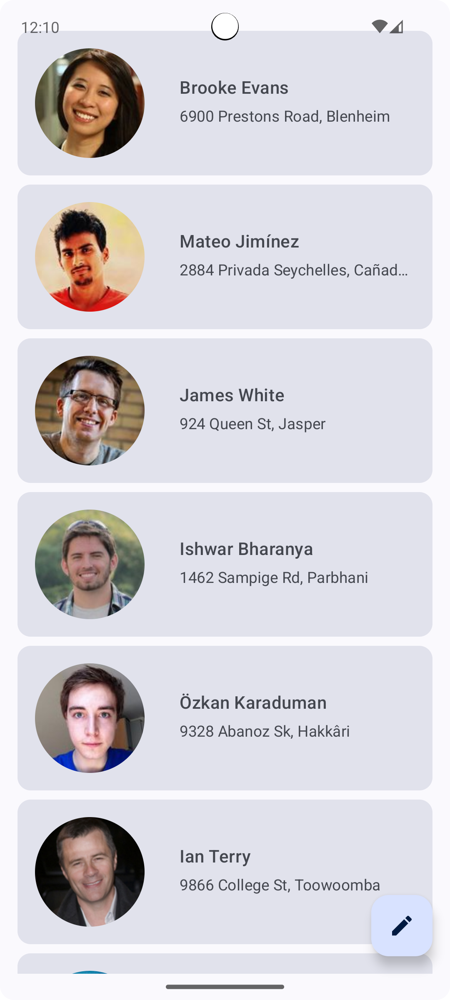
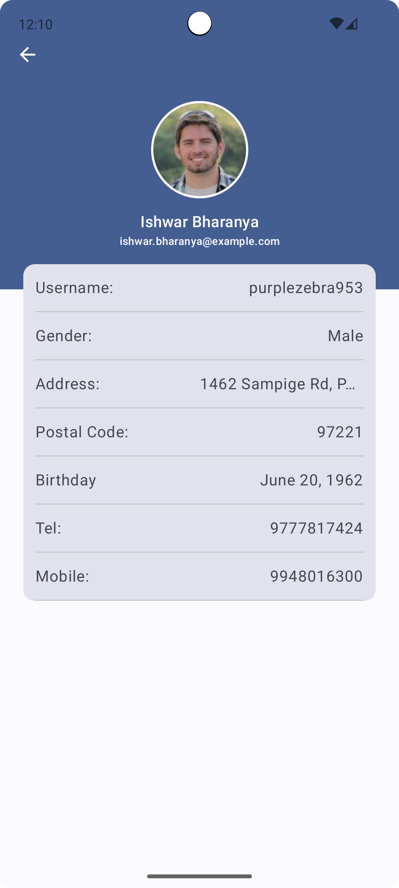

# RandomUsersApp

## Description
This Android app allows you to generate random users and view their details.

## Screenshots

## Features
- Generate a list of random users using the Random User Generator API.
- View detailed information about each user, including name, email, location, etc.
- Display user images.
- Error handling for network or API issues.

## Getting Started
1. Clone the repository.
2. Open the project in Android Studio.
3. Build and run the app on an emulator or a physical device.

## Usage
1. Enter a number between 1 and 5000 in the input field.
2. Tap the "Generate Users" button.
3. The app will display a list of random users.
4. Tap on a user to view their detailed information.

## Technologies Used
- Kotlin
- Jetpack Compose
- Retrofit
- Coroutines
- Hilt
- Glide